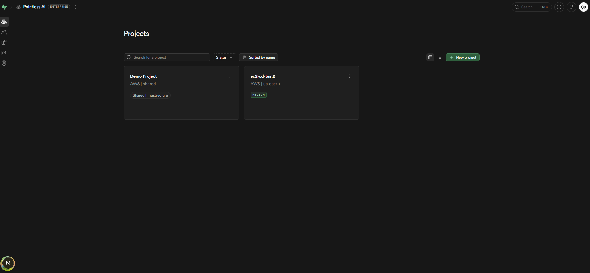

# supabase-console

Multi-tenant control panel for provisioning and managing Supabase projects on shared local infrastructure or dedicated AWS EC2.



## Features

- **Multi-tenant** — provision and manage many Supabase projects from one dashboard.
- **Shared or dedicated** — run a project on shared infrastructure or its own dedicated AWS EC2 instance.
- **Dedicated extras** — resize compute and disk, custom domains with automatic HTTPS, and a connection pooler.
- **Security & org** — SSO, MFA, audit logs, scoped access tokens, and per-organization AWS credentials.

## Installation

This repo is the **control-plane backend** (`:3000`). The dashboard is a
[forked Supabase Studio](https://github.com/notpointless/supabase) (`:8082`) that proxies to it — run both.

Requires Node, pnpm, Docker, and the `pointless` CLI.

```bash
# 1. Backend (this repo)
git clone https://github.com/notpointless/supabase-console.git
cd supabase-console && pnpm install
cp .env.example .env          # fill in the values
pointless run migrate
pointless dev                 # backend on :3000

# 2. Dashboard (the forked Studio)
git clone https://github.com/notpointless/supabase.git
cd supabase/apps/studio && pnpm install
# set apps/studio/.env.local: CONSOLE_API_URL=http://localhost:3000, NEXT_PUBLIC_IS_PLATFORM=true
pnpm dev                      # dashboard on :8082
```

Open `http://localhost:8082/dashboard` — it redirects to **/setup/install** to create the first admin.

## Commands

```bash
pointless dev      # run locally with hot reload
pointless test     # run the test suite
pointless lint     # format + lint + typecheck
pointless build    # produce release artifacts
```
